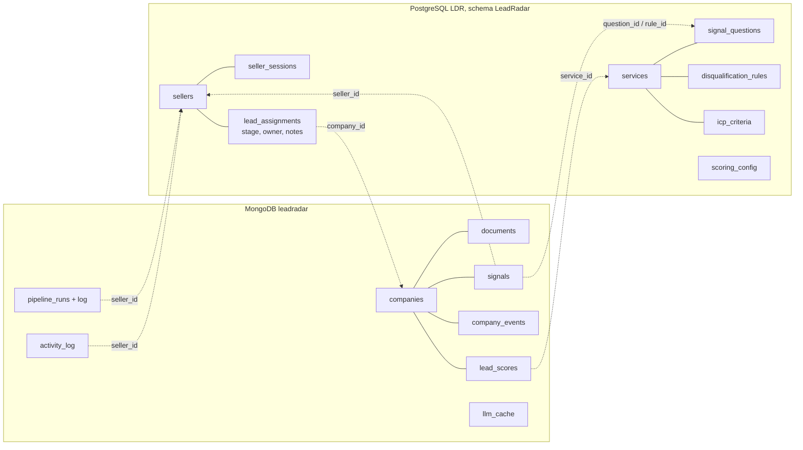
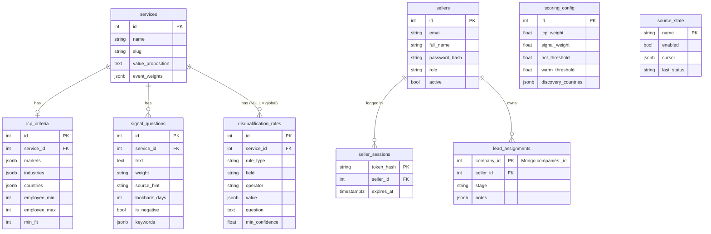

# Orange Signals: AI B2B sales intelligence for Orange Systems

This platform turns public company information into scored, evidence-backed sales leads. It automates the
manual process described in Annex 1:

```
ICP → Accounts → Public data → Signals → Interpretation → Score → Prioritised accounts
```

Sales users configure an **Ideal Customer Profile**, **signal questions** with weights, **negative signals** and
**disqualification rules** for each service. The platform collects news, website, annual-report and job-posting
data, has an LLM answer every question *with verbatim evidence*, detects business events, then scores and
explains each company × service lead.

## Repository layout

| Path | What |
|---|---|
| `backend/` | FastAPI REST API, PostgreSQL models + Alembic migrations (sellers, config), MongoDB store (companies, AI data, logs), scoring engine, run orchestration, outreach, CRM export |
| `pipeline/` | `sales_pipeline` package: collectors (news / web / jobs), LangGraph signal-extraction graph, LLM backends, prompts, calibration set |
| `frontend/` | React + TypeScript + Vite + Tailwind CRM dashboard (GIG-33 to GIG-37) with seller login, wired to the API (demo data only when the API is down), see `frontend/README.md` |
| `infra/` | Deployment notes / manifests |

## Quick start

Requirements: Python 3.11+, Node 22.22+, PostgreSQL 15/16 and MongoDB 6+ (see [Databases](#databases)).
PostgreSQL tables live in the `LeadRadar` schema of the `LDR` database: open LDR in DBeaver and run
[`docs/database/postgres_schema.sql`](docs/database/postgres_schema.sql) (Execute script, Alt+X), or create the schema
(`CREATE SCHEMA "LeadRadar";`) and let `alembic upgrade head` build the tables. MongoDB creates its database on first
write. Connection strings go in `.env` (`DATABASE_URL` with `?options=-csearch_path%3D%22LeadRadar%22`, `MONGO_URI`, `MONGO_DB`).

```bash
cp .env.example .env          # set DATABASE_URL / MONGO_URI; optional: ANTHROPIC_API_KEY, NEWSAPI_KEY, SERPAPI_KEY, HUBSPOT_TOKEN
python -m venv .venv && . .venv/bin/activate
pip install -e pipeline -r backend/requirements.txt

cd backend
alembic upgrade head && python -m app.seed   # configuration; add --demo for 8 demo companies
uvicorn app.main:app --reload   # http://localhost:8000/docs

cd ../frontend                  # second terminal
npm install && npm run dev      # http://localhost:5173
```

- API + Swagger: http://localhost:8000/docs
- Frontend: http://localhost:5173
- Start a run: `curl -X POST localhost:8000/runs -H 'content-type: application/json' -d '{}'`
- Admin account (created in the database, never through the API): `python -m app.admin create --email you@company.md --name "Your Name"` (asks for the password)

**Offline mode:** without `ANTHROPIC_API_KEY` the pipeline uses a deterministic keyword backend. It never produces
a false "yes", but it misses a lot. With `OFFLINE_COLLECT=true` nothing is fetched from the internet and only stored
documents are analysed. `python -m app.seed --demo` loads 8 demo companies and sample documents paraphrasing the Annex 1
Lufthansa / DHL examples (marked `meta.sample`, URLs on the reserved `.example` domain) so the demo works end to end
without keys; `python -m app.seed --remove-demo` deletes them again (demo companies that a registry has confirmed
in the meantime are real and stay). For real data, load the 1000+ company universe below.

### Tests and build

```bash
cd backend && pytest -q          # backend tests (SQLite + a throwaway MongoDB database per test, no network)
cd ../pipeline && pytest -q      # pipeline tests (mocked HTTP + mocked Anthropic transport)
python calibration/run_calibration.py --provider anthropic   # signal-answer precision (needs a key)
cd ../frontend && npm run build  # type-check + production build
```

## Data sources: discovery and enrichment (GIG-14)

The platform works in two modes. Limits, keys and fallbacks for every source are listed in
[`docs/data-sources.md`](docs/data-sources.md), which is generated from `pipeline/sales_pipeline/sources/catalog.py`.

- **Discovery (signal → company)** builds the lead universe automatically. The platform searches for the signal
  (an IT tender, a ransomware victim, an RPA job posting, an 8-K cyber disclosure, a press release) and creates or
  matches the company it names. Companies are resolved by web domain, then by normalised name ("GitLab Inc." =
  "GITLAB INC (GTLB)" = "GitLab"). Headlines the parser can't read go to the small LLM for company extraction.
  Sources: TED, MTender, UK Contracts Finder, World Bank, Arbeitnow, Adzuna, HN "Who is hiring", Remotive,
  RemoteOK, Jobicy, Himalayas, The Muse, We Work Remotely, Google News topics (per country, `when:1h/1d`),
  PR Newswire, GlobeNewswire, Bing News, NewsData.io, Currents, ransomware.live, HIBP, DataBreaches.net,
  SEC 8-K Item 1.05 / 5.02 and SEC Form D.
- **Enrichment (company → signals)** runs per company inside enrichment runs: company news (local-language Google
  News, throttled GDELT, NewsAPI), website crawl and tech stack, ATS boards (Greenhouse, Lever, Ashby, Workable,
  SmartRecruiters, Recruitee, Personio), SerpAPI Google Jobs (top N only), Wikidata and GLEIF firmographics
  (Crunchbase replacement), CISA KEV matched against the detected tech stack, and SEC 10-K language for US companies.

A **discovery run** (`POST /discovery/runs`) syncs the selected sources and analyses every company they touched,
using the documents just found. It then fully enriches the `enrich_top_n` best new leads that pass the ICP and the
rules. Each source keeps a cursor in `source_state`, so a sync only fetches what is new. Documents are deduplicated
by content hash, so only new text reaches the LLM. With `SCHEDULER_ENABLED=true` the backend syncs every source
on its catalogue interval (15 min for press releases, hourly for tenders, 6 h for job boards).

**Target markets** ("change the country") are a config value: `PUT /scoring-config` with
`discovery_countries: ["RO", "MD"]`. They drive TED buyer countries, Adzuna countries, Google News editions and
job-location filters. **B2B only**: the global rule "Pure B2C business" disqualifies companies marked `business_model = b2c`.

Check every source live from a machine with internet access (nothing is written):

```bash
cd pipeline && SEC_USER_AGENT="Your Name you@example.com" COUNTRIES=RO,MD python -m sales_pipeline.sources.smoke
```

## Building a universe of 1000+ real companies

One command loads real companies from open registries, fetches their news and scores them:

```bash
cd backend
python -m app.bootstrap --countries RO,MD,DE,AT,PL,NL,GB --target 1000 --enrich-top 30
# or via the API: POST /bootstrap/runs {"countries": ["RO","MD","DE"], "target": 1000, "enrich_top_n": 30}
```

1. **Companies** come from Wikidata: companies with an official website in each country, best-known first (by
   Wikipedia sitelinks), with industry (mapped onto the ICP vocabulary), employees, LEI and stock listing. Countries
   with few Wikidata companies (e.g. MD) hand their shortfall to the others; `--gleif-fill` tops up with registered
   legal entities from GLEIF (legal name and LEI only).
2. **News**: real articles per company from Google News in the company's language (throttled, retried on 429).
   Only articles that name the company are kept. `--gdelt` adds GDELT, which is much slower (1 request per 5 s).
3. **Analysis**: every company × service is answered and scored. The offline heuristic is free; Claude runs when
   `ANTHROPIC_API_KEY` is set.
4. **Enrichment**: the `--enrich-top` best leads get the full crawl (website, ATS jobs, registries, CISA KEV, SEC).

Every company keeps its registry reference (`registry_profiles.wikidata.wikidata_id` / `lei`), and every signal keeps
its source URL, so nothing on screen is invented. Re-running is idempotent: companies are matched by domain /
normalised name, documents by content hash, and news is not refetched within 24 h.

**Scale** (measured with mocked registries): 1,002 companies pass registry load, dedupe, news, analysis and scoring
in about 30 s with the heuristic backend. With real sources, expect about 5-10 min for Wikidata + Google News,
depending on their rate limits. Claude analysis makes one batched call per company: plan roughly USD 40-130 per
1,000 companies with `claude-opus-5` at medium effort, depending on how much text each company has. Results are
cached, so re-runs only pay for companies whose documents changed.

## Architecture

```mermaid
flowchart LR
  subgraph Sources
    N[GDELT / NewsAPI / Google News RSS]
    W[Company websites, newsrooms, annual-report PDFs]
    J[SerpAPI Google Jobs, Greenhouse / Lever / Workable / Personio, careers pages]
    M[Manual: CSV / Crunchbase import, LinkedIn validation, manual signals]
  end
  Sources --> C[Collectors → common Document, dedupe by URL + title, content hash]
  C --> DB[(MongoDB documents)]
  DB --> G
  subgraph G[LangGraph]
    L[load_context] --> R[relevance_filter<br/>lexical, per question] --> A[answer_questions<br/>Claude, batched, JSON schema] --> E[detect_events<br/>small model] --> AG[aggregate]
  end
  A -. quotes verified against sources .-> A
  AG --> S[(MongoDB signals, company_events)]
  S --> SC[Scoring engine<br/>ICP fit + weighted signals + rules]
  CFG[(PostgreSQL<br/>ICP, questions, rules, weights)] --> SC
  SC --> LS[(MongoDB lead_scores + breakdown + why-now)]
  LS --> API[FastAPI] --> UI[React dashboard]
  SEL[(PostgreSQL<br/>sellers, stage, owner, notes)] --- API
  API --> CRM[HubSpot / CSV]
```



### AI pipeline (`pipeline/sales_pipeline/graph.py`)

1. **load_context**: company documents plus the active questions of every selected service, and `llm_question` disqualification rules.
2. **relevance_filter**: splits documents into passages and scores them against each question's keywords. It respects `source_hint` (news/web/jobs) and `lookback_days`. Only the top passages reach the LLM.
3. **answer_questions**: questions for the same company are **batched** into one structured-output call (`claude-opus-5` by default, server-side refusal fallback enabled). Output is strict JSON: `answer yes|no|unknown`, `confidence`, `evidence[{quote, doc_id}]` and `reasoning`.
   **Anti-hallucination:** each quote must fuzzy-match (≥85) the text of a passage selected *for that question*. Otherwise the answer becomes `unknown` with confidence 0.
4. **detect_events**: `claude-haiku-4-5` classifies news and web passages into `security_incident`, `leadership_change`, `tech_stack`, `compliance_event` and `corporate_event` (with polarity), which builds the company timeline.
5. **aggregate**: hands results to the backend, which stores only new or changed signals. Manual signals from reps are never overwritten.

Cost and speed (GIG-28): responses are cached in the MongoDB `llm_cache` collection by (task, model, company, question, passages), so re-runs cost nothing unless the data changed. Companies run in parallel behind a semaphore, and LLM calls share a concurrency limit. Tokens and estimated USD cost are recorded on each `pipeline_runs` document, next to the run log.

### Scoring (`backend/app/scoring/engine.py`)

```
signal_score = ( Σ w·c·r  over positive "yes" signals
               + event bonus (service.event_weights)
               − Σ w·c·r  over negative "yes" signals ) / Σ w(positive questions) × 100     (clamped 0–100)
final_score  = 0.3 × icp_fit + 0.7 × signal_score                                          (weights configurable)
w: High=3 Medium=2 Low=1    c: confidence    r: recency 1.0 (<30d) 0.7 (<90d) 0.4 (<180d) 0.1 (older) 0.5 (undated)
tier: Hot ≥70, Warm 40–69, Cold <40, Disqualified if a hard rule matches
```

- **ICP fit (0–100)**: industry 30, geography 30 (countries or markets such as DACH/EU/Nordics), size 30, revenue 10. Only configured criteria count. Partial credit is given near the range, and unknown data gets half credit. Leads under `min_fit` are hidden by default (`include_outside_icp=true` shows them).
- **Disqualification**: `field_rule` (existing client, competitor, insolvent, < 50 employees, sanctioned country) or `llm_question` (e.g. insolvency reported, with a confidence threshold). The reasons are returned on the lead.
- Every score has a **breakdown**: points per signal and event (for the bar chart), ICP components, top 3 signals with source links, a recommendation (`contact now` / `nurture` / `monitor` / `exclude`) and a 2–3 sentence "why now" summary generated only from the evidence-backed signals.
- Scores are pure functions of stored data. Every configuration change (ICP, questions, rules, weights) recomputes them instantly, with no LLM call.

## Databases

Two databases, each holding what it is best at:

| | PostgreSQL (`DATABASE_URL`) | MongoDB (`MONGO_URI` / `MONGO_DB`) |
|---|---|---|
| What | Seller accounts and the relational configuration that sales and admins edit | Companies and everything collected or inferred about them, AI output and logs |
| Tables / collections | `sellers`, `seller_sessions`, `lead_assignments`, `services`, `icp_criteria`, `signal_questions`, `disqualification_rules`, `scoring_config`, `source_state` | `companies`, `documents`, `signals`, `company_events` (alerts), `lead_scores`, `pipeline_runs` (with log), `llm_cache`, `counters` |
| Schema | Alembic migrations (`backend/alembic/versions`) | Indexes created on startup (`backend/app/mongo.py`) |

Companies, leads and runs keep **integer ids** (from the `counters` collection), so URLs such as `/companies/12` and
the frontend are unchanged.

**How the two databases work together**



- **Joins happen in the API**: `/dashboard/companies` returns scores and evidence from MongoDB together with the stage,
  owner and note count from PostgreSQL; company pages add the MongoDB activity log to the PostgreSQL notes.
- **Structure is enforced on both sides**: PostgreSQL through the Alembic schema and foreign keys, MongoDB through a
  `$jsonSchema` validator on every collection (required fields, types, allowed values such as tiers and answers) plus
  unique indexes (domain, company x content hash, company x service).
- **No foreign keys across databases**, so deletes cascade in code (a service, question, rule or company removes its
  Mongo documents and its lead assignment), and `GET /admin/integrity` checks every cross reference; `POST
  /admin/integrity/repair` removes orphans left behind by a crash or a manual edit in DBeaver / Compass.
- **Audit trail**: every successful change through the API (and each login / logout) is written to `activity_log`
  with the seller id and name from PostgreSQL.

The PostgreSQL structure is also a runnable SQL script, [`docs/database/postgres_schema.sql`](docs/database/postgres_schema.sql), which creates the `LeadRadar` schema in LDR (DBeaver: Execute script).
In VS Code, `.vscode/settings.json` adds both databases to the SQLTools and MongoDB sidebars ("LeadRadar PostgreSQL (LDR)",
port 5433 on the dev machine, asks for the password; "LeadRadar MongoDB"); the recommended extensions are in `.vscode/extensions.json`.

### PostgreSQL (ERD)



### MongoDB collections

| Collection | Key fields | Indexes |
|---|---|---|
| `companies` | `name`, `domain`, `normalized_name`, `industry`, `country`, `employee_count`, `origin`, `discovered_via`, `registry_profiles`, `tech_stack`, `linkedin_validation` | unique `domain`, `normalized_name`, (`country`, `origin`) |
| `documents` | `company_id`, `source_type`, `url`, `title`, `content`, `published_at`, `content_hash`, `meta` | unique (`company_id`, `content_hash`) |
| `signals` | `company_id`, `service_id`, `question_id` / `rule_id`, `origin`, `answer`, `confidence`, `evidence[{quote,url,date}]`, `reasoning`, `run_id` | (`company_id`, `detected_at`), `question_id`, `rule_id` |
| `company_events` | `company_id`, `event_type`, `title`, `summary`, `event_date`, `url`, `polarity` | (`company_id`, `event_date`) |
| `lead_scores` | `company_id`, `service_id`, `icp_score`, `signal_score`, `final_score`, `tier`, `breakdown`, `explanation`, `previous_score` | unique (`company_id`, `service_id`), `final_score` |
| `pipeline_runs` | `kind`, `status`, `params`, `progress`, `stats` (tokens, cost), `log[{t,msg}]` (last 200-300 lines), `error` | `status` |
| `llm_cache` | `_id` = hash of (task, model, company, question, passages), `value` | primary key |

## API (full contract at `/docs`)

| Area | Endpoints |
|---|---|
| Services | `GET/POST /services`, `GET/PUT/DELETE /services/{id}` |
| ICP | `GET /icp`, `GET/PUT/DELETE /icp/{service_id}` |
| Signal questions | `GET/POST /services/{id}/questions`, `PUT/DELETE /services/{id}/questions/{qid}` |
| Rules | `GET/POST /services/{id}/rules`, `GET/POST /rules` (global), `PUT/DELETE /rules/{id}` |
| Scoring | `GET/PUT /scoring-config`, `POST /scores/recompute` |
| Leads | `GET /leads?service=apa&tier=Hot,Warm&country=DE&industry=bank&min_score=&sort=score&include_outside_icp=` |
| Companies | `GET/POST /companies`, `POST /companies/import` (CSV / Crunchbase export), `GET/PUT/DELETE /companies/{id}`, `GET /companies/{id}/events`, `GET /companies/{id}/documents`, `PUT /companies/{id}/linkedin`, `POST /companies/{id}/manual-signal`, `POST /companies/{id}/explain?service=` |
| Sources | `GET /sources` (catalogue + last sync, status, errors, missing keys), `GET/PUT /sources/{name}` (enable, interval, reset cursor), `POST /sources/{name}/sync`, `GET /sources/not-used` |
| Bootstrap | `POST /bootstrap/runs` (`{countries, target, gleif_fill?, news?, gdelt?, enrich_top_n?}`), `GET /dashboard/companies` (every scored company with scores and evidence in one call) |
| Discovery | `POST /discovery/runs` (`{sources?, enrich_top_n?}`); leads carry `is_new`, `previous_score`, `origin`, `discovered_via`; `GET /leads?origin=ted&changed_since_hours=24` |
| Runs | `POST /runs` (`{company_ids?, service_ids?, sources?, explain?}`), `GET /runs`, `GET /runs/{id}` (status, progress, log, per-source stats, tokens, cost) |
| Outreach | `POST /companies/{id}/outreach?service=&channel=email\|linkedin\|followup&tone=formal\|consultative&language=EN\|RO\|DE` |
| CRM | `GET /export/leads.csv`, `GET /export/leads.json`, `POST /crm/hubspot` (body: lead ids) |
| Auth | `POST /auth/login` (`{email, password}` → bearer token, 14 days), `POST /auth/logout`, `GET /auth/me` |
| Sellers | `POST /sellers` (admin only, creates `seller` accounts), `GET /sellers`, `PUT /sellers/{id}` (yourself: name, password; an admin on a seller: also `active`), `DELETE /sellers/{id}` (admin, seller accounts) |
| Lead stage / owner | `GET /assignments?seller_id=`, `GET/PUT /companies/{id}/assignment` (`{stage?, seller_id?, unassign?}`), `POST /companies/{id}/notes` |
| Activity / integrity | `GET /activity?company_id=&seller_id=` (MongoDB log), `GET /admin/integrity`, `POST /admin/integrity/repair` (admin) |

Every endpoint except `/health`, `/auth/status` and `/auth/login` needs `Authorization: Bearer <token>`
(`AUTH_REQUIRED=false` turns this off for local experiments).

**Admin accounts are managed only in the database.** The API never creates an admin, never changes a role, and never
deactivates, resets or deletes another admin; there is no free first account either. Use the backend command, which
writes straight to PostgreSQL and stores only the password hash:

```bash
cd backend
python -m app.admin create --email admin@orange.md --name "Admin Orange"   # asks for the password twice
python -m app.admin password --email admin@orange.md                         # new password, logs out every session
python -m app.admin deactivate --email admin@orange.md                       # or: activate
python -m app.admin list
```

LinkedIn is used **only** for manual validation fields entered by reps. Nothing is scraped from LinkedIn.

## Web application (`frontend/`)

A CRM-style dashboard for sales reps with no AI background: they see who to call, why now, and the evidence
behind every point of the score. The UI is in Romanian and follows the Orange visual style of
[orange.md](https://www.orange.md).

**Stack:** React 19, TypeScript, Vite 8, Tailwind CSS 4, React Router, lucide icons.

### Pages

| Route | Page | What the rep can do |
|---|---|---|
| `/` | Home | KPIs (new leads, hot leads, signals in the last 24 h, active sources), fresh-signal feed, top 5 leads to contact, leads per service |
| `/leads` | Leads | Sortable table with score, score change, best-matching service, main signal with source, stage and owner; filters for service, country, stage, "new only" and disqualified; global search; CSV export |
| `/leads/:id` | Company record | Score out of 100 with per-service breakdown, AI "why this lead, now", every signal with its question, verbatim quote, source, date, AI confidence and points; timeline; notes; stage change; manual LinkedIn check; send to HubSpot; generate message |
| `/pipeline` | Pipeline | Kanban by stage (New → Qualified → Contacted → Negotiation → Won), drag and drop |
| `/config` | Configuration | Signal questions per service in plain language with High / Medium / Low weight and on/off switch; negative and disqualifying rules; ICP (markets, industries, minimum size, B2B only); scoring points, hot-lead threshold and signal decay |
| `/runs` | Sources and runs | The five refresh tiers (stream, RSS, incremental, list comparison, daily), status and last run of every source, new documents per source, "Run now" |

### Design

- Orange `#FF7900` for fills and `#F16E00` for text on white, black header, `#EEEEEE` bands, Helvetica Neue bold,
  square corners and 2px-border buttons, all defined as tokens in `frontend/src/index.css`.
- The lead score is drawn as 10 orange squares, echoing the pixel motif of Orange Business.
- Service colours (`#527EDB`, `#50BE87`, `#A885D8`) pass a colour-blind separation check and always sit next to a
  text label. Status is never shown by colour alone.

### Data and API wiring

The app loads its data from the backend at startup (`frontend/src/data/backend.ts` maps API responses onto the UI
types; the pages still read through `frontend/src/data/api.ts`). If the API is unreachable, or `VITE_USE_MOCK=true`,
it falls back to 15 fictional demo companies on the reserved `.example` domain (`frontend/src/data/mock.ts`) and shows
a "Date demo" badge. The API base URL comes from `VITE_API_URL` (default `http://localhost:8000`).

| UI | Backend endpoint | Status |
|---|---|---|
| Login | `/auth/status`, `/auth/login`, `/sellers` | Live: seller login; on an empty database the screen creates the first (admin) account |
| Leads, Home, Pipeline | `GET /dashboard/companies`, `PUT /companies/{id}/assignment` | Live: dragging a card saves the stage in PostgreSQL for the whole team |
| Company record | `/dashboard/companies`, `/companies/{id}/assignment`, `/companies/{id}/notes`, `/activity` | Live: scores, why-now, evidence; stage, owner and notes are saved; the timeline shows who did what |
| Configuration | `/services/{id}/questions`, `/rules`, `/icp`, `/scoring-config` | Live: loads the stored values; "Salvează și recalculează" saves questions, rules, ICP and scoring, and the scores are recomputed |
| Sources and runs | `GET /sources`, `POST /discovery/runs`, `GET /runs/{id}` | Live: per-source status, last run, errors and missing keys; "Rulează acum" starts a real discovery run |
| Generate message | `POST /companies/{id}/outreach` | Live: email / LinkedIn / follow-up in RO, EN or DE, with a check that it cites a real signal |
| Send to HubSpot / Export CSV | `POST /crm/hubspot`, `GET /export/leads.csv` | Live (needs `HUBSPOT_TOKEN`); CSV exported in the browser |
| LinkedIn check | `PUT /companies/{id}/linkedin` | Opens a LinkedIn search for manual review; fields not yet saved |

## Jira mapping (frontend / UX / research)

| Task | Status |
|---|---|
| GIG-11 Kick-off: MVP, roles, hourly plan | Done: plan, architecture proposal and scoring philosophy in the team Notion page |
| GIG-14 API keys and limits | Research done: ~45 public sources and APIs checked for price, limits and refresh mechanism, about 40 tested live; catalogue in Notion. Keys (SerpAPI, Adzuna, NewsAPI, LLM) still to be created |
| GIG-18 Initial config with 2 demo services | Partly done: the UI ships Automation, Cyber and Digital question sets; still to align with the APA + Cyber seed in the backend |
| GIG-19 Target company list | To do. Crunchbase's free API no longer exists, so the list goes through `POST /companies/import` (CSV) |
| GIG-24 LinkedIn manual validation | Partly done: "LinkedIn" button on the company record for a manual check; the form behind `PUT /companies/{id}/linkedin` is still to do |
| GIG-31 Validate scoring on Annex 1 | To do (calibration set in `pipeline/calibration/`) |
| GIG-33 Frontend setup | Done: React + TypeScript + Vite + Tailwind, Orange design tokens, CRM layout, routing |
| GIG-34 Leads page | Done, live data |
| GIG-35 Company record | Done, live data: stage, owner, notes, timeline, outreach message, HubSpot |
| GIG-36 Configuration page | Done: questions, rules, ICP and scoring load from and save to the API |
| GIG-37 Runs page | Done, live source status and "Run now" |
| GIG-39 Value-proposition library | To do |
| GIG-41 Final demo dataset | To do |
| GIG-42 Testing, bug bash, code freeze at H33 | To do |
| GIG-43 Jury presentation | To do |
| GIG-44 5-minute demo script and backup video | To do |
| GIG-45 README, architecture docs, deploy | In progress: web application section above and `frontend/README.md` |

**Next frontend step:** a screen for admins to manage seller accounts (the API is ready: `/sellers`), and the manual
LinkedIn validation form behind `PUT /companies/{id}/linkedin`.

## Jira mapping (backend / data / AI: Gheorghe Singereanu)

| Task | Status in code |
|---|---|
| GIG-14 Sources, keys, limits | Source catalogue with limits/fallback (`docs/data-sources.md`), 25 discovery + 8 enrichment sources, cursors, throttling (GDELT ≥ 5 s, SEC 10 req/s), 429 backoff, `/sources` status API, scheduler, live smoke script |
| GIG-12 Repo setup | Structure, `.env.example`, local run without containers (see Quick start) |
| GIG-13 Database schema | PostgreSQL for sellers + configuration (`backend/app/models.py`, Alembic `0001`-`0003`), MongoDB for companies, AI data and logs (`backend/app/mongo.py`), see [Databases](#databases) |
| GIG-15 ICP | `/icp` CRUD, fit score 0–100 with partial matches, `min_fit` filter |
| GIG-16 Signal questions | CRUD with weight / source_hint / lookback_days; APA + Cyber examples seeded; new questions are picked up by the next run (tested) |
| GIG-17 Negative signals + disqualifiers | `is_negative` questions subtract; `field_rule` / `llm_question` rules; reasons shown on the lead |
| GIG-20 News | GDELT + NewsAPI + Google News RSS, company-mention filter, URL + title dedupe |
| GIG-21 Websites | Polite crawler (robots.txt, page cap, rate limit), trafilatura, PDF reports, tech-stack detection, optional Playwright |
| GIG-22 Jobs | SerpAPI Google Jobs, Greenhouse / Lever / Workable / Personio, careers page; roles mapped to RPA / AI-ML / Process Excellence / BA / Security / Digital Transformation |
| GIG-23 Orchestration | Async runner, content-hash dedupe, LLM cache, `pipeline_runs` progress/log, `POST /runs`, idempotent re-runs (tested) |
| GIG-25 LangGraph | 5-node typed graph, retries, end-to-end tested |
| GIG-26 Prompts + evidence | Strict JSON, verbatim quotes verified, few-shot from Annex 1, 12-case calibration set in `pipeline/calibration/` |
| GIG-27 Events | Event classifier + `company_events` timeline, mapped to services via `event_weights` |
| GIG-28 Cost / speed | Batching, cache, small model for classification, concurrency limits, token + cost tracking |
| GIG-29 Scoring | Formula above, configurable, instant recompute |
| GIG-30 Explanation | Breakdown, top 3 signals + links, recommendation, AI "why now" for Hot/Warm |
| GIG-32 REST API | All endpoints above, OpenAPI at `/docs` |
| GIG-38 Outreach | Email / LinkedIn / follow-up drafts grounded in real signals, length limits enforced, `grounded` flag |
| GIG-40 CRM | CSV / JSON export; HubSpot company upsert + note |

### Verification status (25 Sep 2026)

- **Local stack: verified.** PostgreSQL 15 (migrations 0001-0003) + MongoDB 7, seed, API, seller login and lead
  assignments, a pipeline run and a live discovery run; all backend and pipeline tests pass, 1,002 companies load and
  score in about 20 s with the heuristic backend, and the frontend builds.
- **Live collectors and discovery sources: not verified.** The build sandbox's network policy rejects every external
  data host (`python -m sales_pipeline.sources.smoke` → 403 from the egress proxy for all 30 checks). They are covered
  by mocked-HTTP tests built from each API's documented response format. Run the smoke script on a machine with
  internet access to confirm them live.
- **Claude answers: not measured.** No `ANTHROPIC_API_KEY` was available. The Anthropic backend is tested through the
  real SDK with a mocked transport (request shape and parsing). The GIG-26 ≥ 80% precision target still has to be
  measured with `calibration/run_calibration.py --provider anthropic`. The offline keyword backend scores 58% accuracy
  (7/12) and 100% yes-precision (4/4) on that set.
