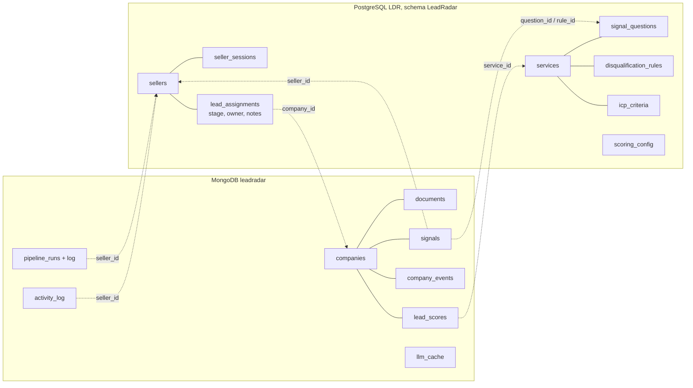
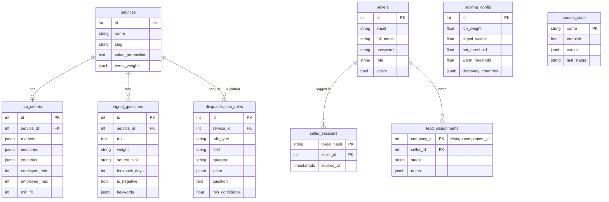

# Orange Signals: AI B2B sales intelligence for Orange Systems

This platform turns public company information into scored, evidence-backed sales leads. It automates the
manual process described in Annex 1:

```
ICP → Accounts → Public data → Signals → Interpretation → Score → Prioritised accounts
```

Sales users configure an **Ideal Customer Profile**, **signal questions** with weights, **negative signals** and
**disqualification rules** for each service. The platform collects news, website, annual-report and job-posting
data, has an LLM answer every question *with verbatim evidence*, detects business events, then scores and
explains each company × service lead.

## Repository layout

| Path | What |
|---|---|
| `backend/` | FastAPI REST API, PostgreSQL models + Alembic migrations (sellers, config), MongoDB store (companies, AI data, logs), scoring engine, run orchestration, outreach, CRM export |
| `pipeline/` | `sales_pipeline` package: collectors (news / web / jobs), LangGraph signal-extraction graph, LLM backends, prompts, calibration set |
| `frontend/` | React + TypeScript + Vite + Tailwind CRM dashboard (GIG-33 to GIG-37) with seller login, wired to the API (demo data only when the API is down), see `frontend/README.md` |
| `infra/` | Deployment notes / manifests |

## Quick start

Requirements: Python 3.11+, Node 22.22+, PostgreSQL 15/16 and MongoDB 6+ (see [Databases](#databases)).
PostgreSQL tables live in the `LeadRadar` schema of the `LDR` database: open LDR in DBeaver and run
[`docs/database/postgres_schema.sql`](docs/database/postgres_schema.sql) (Execute script, Alt+X), or create the schema
(`CREATE SCHEMA "LeadRadar";`) and let `alembic upgrade head` build the tables. MongoDB creates its database on first
write. Connection strings go in `.env` (`DATABASE_URL` with `?options=-csearch_path%3D%22LeadRadar%22`, `MONGO_URI`, `MONGO_DB`).

```bash
cp .env.example .env          # set DATABASE_URL / MONGO_URI; optional: ANTHROPIC_API_KEY, NEWSAPI_KEY, SERPAPI_KEY, HUBSPOT_TOKEN
python -m venv .venv && . .venv/bin/activate
pip install -e pipeline -r backend/requirements.txt

cd backend
alembic upgrade head && python -m app.seed   # configuration; add --demo for 8 demo companies
uvicorn app.main:app --reload   # http://localhost:8000/docs

cd ../frontend                  # second terminal
npm install && npm run dev      # http://localhost:5173
```

- API + Swagger: http://localhost:8000/docs
- Frontend: http://localhost:5173
- Start a run: `curl -X POST localhost:8000/runs -H 'content-type: application/json' -d '{}'`
- Admin account (created in the database, never through the API): `python -m app.admin create --email you@company.md --name "Your Name"` (asks for the password)

**AI providers:** without `ANTHROPIC_API_KEY`, the analysis (signal answers with verbatim evidence, events,
"why now", contact messages) runs on OpenAI-compatible LLM APIs chained in `LLM_CHAIN` order
(`pipeline/sales_pipeline/openai_compat.py`). The default chain is `groq,ollama`: Groq `openai/gpt-oss-120b`
(`GROQ_API_KEY`) on the pay-per-token Developer tier ($0.15 / $0.60 per million tokens, ~$5 for a full analysis of
~860 companies; set a spending limit in console.groq.com), then the local base model: Ollama at `OLLAMA_URL` with
`OLLAMA_MODEL` (default `qwen2.5:3b`, CPU only, one request at a time, 15 min timeout). Free providers can be added
back, e.g. `LLM_CHAIN=gemini,groq,mistral,openrouter,ollama` with `GEMINI_API_KEY`, `MISTRAL_API_KEY`,
`OPENROUTER_API_KEY`, `NVIDIA_API_KEY`. All speak the OpenAI chat-completions API and get
the same prompts and JSON schemas as Claude. A model that answers 503 "high demand" hands over to the provider's other
models; a provider over its quota or down is skipped for a while (1 h for a daily quota) and the next one answers; with
none left the offline heuristic does, and its answers are never cached under a model's name, so the next run asks the AI
again. `LLM_PROVIDER=heuristic` forces the offline mode, `LLM_MODEL_OVERRIDES="groq=model|small_model"` changes models.
`/health` reports the active chain.
AI results are kept for when the quotas run out: signal answers and events are cached under their passages, so a company
whose news did not change is never re-asked; a "why now" summary is written for every lead with signals (best first) and
an offline one is redone by the AI on a later run, never the other way round; outreach drafts are saved per lead, signals
and options (`?fresh=true` asks for a new one) and the saved draft is returned while the AI is unavailable. Free tiers may use the prompts to improve their models: only public news is sent.

**Decision-maker contacts (`backend/app/contacts.py`):** `POST /companies/{id}/contacts/discover` looks for the people
to send the contact message to, only where they are really published: the company's own site (home, contact, team /
management / about, Impressum: e-mails on the company's domain, phone numbers, "Name / Role" lines exactly as written),
leadership changes in its news, and, with a key, Hunter.io Domain Search (`HUNTER_API_KEY`: only addresses Hunter found
on public pages) and Apollo.io people search (`APOLLO_API_KEY`: title and LinkedIn; an e-mail only when unlocked and
verified). Nothing is generated: no guessed e-mail patterns. Every contact keeps its sources (URL, the exact line, date);
sellers can add one by hand (marked with who added it) and mark "do not contact", which blocks sending. `GET
/companies/{id}/contacts`, `POST /companies/{id}/contacts`, `PUT /contacts/{id}`, `DELETE /contacts/{id}` (admin, or the
seller who added it), `POST /contacts/{id}/sent` (logged as "sent an e-mail / LinkedIn message to X"). Sites that block
automated visits (403) or time out are reported per source; the other sources still count.

**Deal estimate (value, cost, profit for Orange):** every lead carries `deal_value` and `expected_profit` (`/leads`),
and the company page carries the full estimate per service (`scores[].deal`): first-year project value with a
low-high range, delivery cost, gross profit, win probability of the tier and the assumptions used
(`backend/app/deal_value.py`). Value = service base value x company size (employees, sub-linear) x market price level
(DE/AT = 1, RO 0.6, MD 0.45); cost and profit come from the service's gross margin (22-35%, systems integrators
average 20%, professional services projects 38%). The defaults are public benchmarks (ERP, MDR, RPA pricing; IT
rates by country), listed in `GET /deal-model`; an admin changes any of them with `PUT /deal-model`. Without a known
headcount the size is guessed and the estimate is marked `confidence: low` with a wider range.

**Offline mode:** without any AI key the pipeline uses a deterministic keyword backend. It never produces
a false "yes", but it misses a lot. With `OFFLINE_COLLECT=true` nothing is fetched from the internet and only stored
documents are analysed. `python -m app.seed --demo` loads 8 demo companies and sample documents paraphrasing the Annex 1
Lufthansa / DHL examples (marked `meta.sample`, URLs on the reserved `.example` domain) so the demo works end to end
without keys; `python -m app.seed --remove-demo` deletes them again (demo companies that a registry has confirmed
in the meantime are real and stay). For real data, load the 1000+ company universe below.

### Tests and build

```bash
cd backend && pytest -q          # backend tests (SQLite + a throwaway MongoDB database per test, no network)
cd ../pipeline && pytest -q      # pipeline tests (mocked HTTP + mocked Anthropic transport)
python calibration/run_calibration.py --provider free        # signal-answer precision on the free AI chain (GEMINI_API_KEY, GROQ_API_KEY, ...)
python calibration/run_calibration.py --provider anthropic   # the same with Claude (needs ANTHROPIC_API_KEY)
cd ../frontend && npm run build  # type-check + production build
```

## Deployment (cloud)

| Part | Host | Config |
|---|---|---|
| Frontend | Netlify (site linked to this GitHub repo, redeploys on push) | `netlify.toml` (base `frontend/`); site variable `VITE_API_URL` = the Render URL |
| Backend API | Render (free web service, Frankfurt) | `render.yaml` Blueprint: builds `pipeline` + `backend`, runs migrations and the config seed on start |
| PostgreSQL | Neon (free) | `DATABASE_URL` = direct (not `-pooler`) connection string with `sslmode=require`, `DATABASE_SCHEMA=LeadRadar` |
| MongoDB | MongoDB Atlas (free M0) | `MONGO_URI` = `mongodb+srv://...`, `MONGO_DB=leadradar`; Network Access must allow Render (0.0.0.0/0) |

`DATABASE_SCHEMA` sets the schema on every connection (and `alembic upgrade head` creates it), because poolers such as
Neon's ignore the `?options=-csearch_path` URL parameter used locally. Set `CORS_ORIGINS` on Render to the Netlify URL.
The free Render instance sleeps after 15 minutes without traffic, so the first request afterwards takes about a minute.
Cloud connection strings live in `.env.cloud` locally (ignored by git), never in the repository.

Copying the local data to the cloud (after the first Render deploy has created the tables):

```bash
set -a; . ./.env.cloud; set +a     # PG_CLOUD_URL (postgresql://...), MONGO_CLOUD_URI (mongodb+srv://...)
pg_dump -h localhost -p 5433 -U postgres -d LDR -n '"LeadRadar"' --data-only --exclude-table='"LeadRadar".alembic_version' \
  | psql "$PG_CLOUD_URL" -v ON_ERROR_STOP=1
mongodump --uri mongodb://localhost:27017 --db leadradar --archive \
  | mongorestore --uri "$MONGO_CLOUD_URI" --archive --nsInclude 'leadradar.*' --drop
```

## Data sources: discovery and enrichment (GIG-14)

The platform works in two modes. Limits, keys and fallbacks for every source are listed in
[`docs/data-sources.md`](docs/data-sources.md), which is generated from `pipeline/sales_pipeline/sources/catalog.py`.

- **Discovery (signal → company)** builds the lead universe automatically. The platform searches for the signal
  (an IT tender, a ransomware victim, an RPA job posting, an 8-K cyber disclosure, a press release) and creates or
  matches the company it names. Companies are resolved by web domain, then by normalised name ("GitLab Inc." =
  "GITLAB INC (GTLB)" = "GitLab"). Headlines the parser can't read go to the small LLM for company extraction.
  Sources: TED, MTender, UK Contracts Finder, World Bank, Arbeitnow, Adzuna, HN "Who is hiring", Remotive,
  RemoteOK, Jobicy, Himalayas, The Muse, We Work Remotely, Google News topics (per country, `when:1h/1d`),
  PR Newswire, GlobeNewswire, Bing News, NewsData.io, Currents, ransomware.live, HIBP, DataBreaches.net,
  SEC 8-K Item 1.05 / 5.02 and SEC Form D.
- **Enrichment (company → signals)** runs per company inside enrichment runs: company news (local-language Google
  News and Bing News, throttled GDELT, NewsAPI; in bulk runs also the RO / MD business press: ZF, Economica, Profit,
  StartupCafe, HotNews, G4Media, Biziday, NewsMaker, Ziarul de Gardă, Bani.md, Diez), website crawl and tech stack, ATS boards (Greenhouse, Lever, Ashby, Workable,
  SmartRecruiters, Recruitee, Personio), SerpAPI Google Jobs (top N only), Wikidata and GLEIF firmographics
  (Crunchbase replacement), CISA KEV matched against the detected tech stack, and SEC 10-K language for US companies.

A **discovery run** (`POST /discovery/runs`) syncs the selected sources and analyses every company they touched,
using the documents just found. It then fully enriches the `enrich_top_n` best new leads that pass the ICP and the
rules. Each source keeps a cursor in `source_state`, so a sync only fetches what is new. Documents are deduplicated
by content hash, so only new text reaches the LLM. With `SCHEDULER_ENABLED=true` the backend syncs every source
on its catalogue interval (15 min for press releases, hourly for tenders, 6 h for job boards).

**Target markets** ("change the country") are a config value: `PUT /scoring-config` with
`discovery_countries: ["RO", "MD"]`. They drive TED buyer countries, Adzuna countries, Google News editions and
job-location filters. **B2B only**: the global rule "Pure B2C business" disqualifies companies marked `business_model = b2c`.

Check every source live from a machine with internet access (nothing is written):

```bash
cd pipeline && SEC_USER_AGENT="Your Name you@example.com" COUNTRIES=RO,MD python -m sales_pipeline.sources.smoke
```

## Building a universe of 1000+ real companies

One command loads real companies from open registries, fetches their news and scores them:

```bash
cd backend
python -m app.bootstrap --countries RO,MD,DE,AT,PL,NL,GB --target 1000 --gleif-fill --enrich-top 30
python -m app.bootstrap --refresh-news    # later: news only for the stored companies, then re-score
python -m app.bootstrap --refresh-news --news-providers bing_news   # while Google News answers 503
# or via the API: POST /bootstrap/runs {"countries": ["RO","MD","DE"], "target": 1000, "enrich_top_n": 30}
```

**News curation: only companies whose news explains their situation** (`python -m app.newscuration`, in `backend/`).
The manual research of Annex 1 (read the news, keep the signals that matter, judge them) is automatic:

- Every article is tagged with the topics it covers (`pipeline/sales_pipeline/newstopics.py`, Romanian, German and
  English wording): cost reduction / efficiency programs, digital transformation (cloud, ERP, data, IoT), AI / RPA /
  Agentic AI / process mining, relevant hiring, CIO / COO / digital appointments, shared services and process
  consolidation, technologies and partners in use, security incidents, IT outages, compliance and fines, operational
  problems, financial pressure, growth / investment, and layoffs / hiring freezes / IT budget cuts (a negative signal).
  An article only counts when it really names the company (a one-word name must be written exactly: "Electrica",
  not "energie electrică").
- A company needs at least 5 distinct topical stories from the last 3 years (the same story from several outlets
  counts once). Below 10, it gets a targeted search: Bing News once per theme keyword in the company's language (8
  requests: digitalizare, automatizare, inteligenta artificiala, atac cibernetic, restructurare, pierderi, director,
  angajeaza, or the German / English equivalents), the latest Bing News for the name, and 40 business / tech /
  security press feeds (RO, MD, DE, AT). The profile is stored on the company as
  `news_profile` (stories, strong / negative stories, count per topic, last story date).
- Companies that stay below 5 get `status: insufficient_news` and are hidden from `/leads` and `/dashboard/companies`
  (their data stays; a later run can bring them back). Companies entered by hand are never hidden.
- `--target N` replaces hidden companies with the next best-known real companies from Wikidata: each candidate is
  searched first and only stored when it already has 5 topical stories; rejected candidates are remembered for 30 days.
- The daily refresh re-tags the new articles and updates the statuses of curated companies.
- Google News is no longer queried by default: after ~1,100 requests it answered 503 for hours (26 Sep 2026). The
  articles already collected from it stay stored and analysed; `google_news` / `google_topics` remain opt-in providers,
  as does GDELT (`gdelt_topics`, 1 request / 5 s, nothing for RO / MD). A host that starts blocking (Google, Bing) makes
  every request to it pause (15 / 10 min) instead of failing the rest of the run.

Measured on 26 Sep 2026: before curation only 32 of 984 companies had 5 topical stories; the first targeted search
(then with Google News) took Electrica from 3 to 34 stories (13 about security incidents), Banca Transilvania from 0
to 44 (16 about AI / automation) and Metrorex from 5 to 30. With Bing theme keywords, Moldtelecom got 27 distinct
stories (a cyber attack, a new director, investments) and Dedeman 25 (a digitalisation project).

**Daily refresh in the cloud:** the GitHub Actions workflow `.github/workflows/refresh-news.yml` runs
`python -m app.bootstrap --refresh-news --fresh-hours 20` every day at 03:00 UTC against the cloud databases (and on
demand from Actions → Refresh news → Run workflow). It needs the repository secrets `DATABASE_URL` (Neon,
`postgresql+psycopg://...`) and `MONGO_URI` (Atlas); `ANTHROPIC_API_KEY` is optional. `--fresh-hours` below 24 makes
a company that got news in yesterday's run eligible again today.

1. **Companies** come from Wikidata: companies with an official website in each country, best-known first (by
   Wikipedia sitelinks), with industry (mapped onto the ICP vocabulary), employees, LEI and stock listing. Countries
   with few Wikidata companies (e.g. MD) hand their shortfall to the others; `--gleif-fill` tops up with registered
   legal entities from GLEIF (legal name and LEI only).
2. **News**, from three kinds of sources:
   - **business press of RO / MD**: 11 outlets' RSS feeds (older pages too where the site allows it), fetched once and
     matched to every company by name. One-word names must match with exact capitalisation, and those that are
     usually people or places (e.g. "Roman") are skipped, so an article about a person is not filed under a company;
   - **Bing News** per company, in the company's market edition (no key, ~12 latest articles, 1 request / 1.5 s);
   - **Google News** per company (at most one request every 2 s, 2 in parallel).
   Requests are retried on 429 / 5xx and on network errors, and only articles that name the company are kept.
   Google News answers 503 for hours when it is queried faster; `--refresh-news` fetches news later for the
   companies that have none from the last 24 h, without calling the registries again. `--gdelt` adds GDELT, which is much slower (1 request per 5 s).
3. **Analysis**: every company × service is answered and scored. The offline heuristic is free; Claude runs when
   `ANTHROPIC_API_KEY` is set.
4. **Enrichment**: the `--enrich-top` best leads get the full crawl (website, ATS jobs, registries, CISA KEV, SEC).

Every company keeps its registry reference (`registry_profiles.wikidata.wikidata_id` / `lei`), and every signal keeps
its source URL, so nothing on screen is invented. Re-running is idempotent: companies are matched by domain /
normalised name, documents by content hash, and news is not refetched within 24 h.

**Wikidata in large countries.** The company query only considers companies with at least 3 Wikipedia articles and
retries a timed-out page with smaller pages (250 → 100 → 50 → 25). Wikidata's public endpoint still times out or
rate-limits (429) at busy times for DE, GB, PL and NL; their quota then goes to the other countries and GLEIF fills
the rest, and a later re-run with `--countries DE,GB,PL,NL` adds them (companies are never duplicated).

**Measured on 25-26 Sep 2026 (real sources):** 984 companies loaded (RO 508 + MD 53 from Wikidata, 438 legal entities from
GLEIF; Wikidata timed out for DE, AT, PL, NL and GB). Google News throttled the first run after about 300 companies
(111 articles). `--refresh-news --news-providers bing_news` then added 3,208 Bing News articles and 12 business-press
articles in 24 min: **499 companies now have 3,331 news articles**. Analysis and scoring of all 984 takes about 15 s with
the heuristic backend: 55 "yes" signals, 125 alerts, 3 Warm leads (SecureNET Systems, Transelectrica, OMV Petrom).

**Language.** Questions are written in English but most of this news is Romanian. The relevance filter and the offline
heuristic therefore also search Romanian (and some German) equivalents of every English term (`TERM_TRANSLATIONS` in
`pipeline/sales_pipeline/relevance.py`), accent-insensitive, and the event detector has Romanian patterns
(atac cibernetic, a fost numit director general, insolvență, achiziție, ...). Before this, the same 3,331 articles gave
2 "yes" signals. The heuristic still reads keywords, not meaning (a sponsorship "parteneriat" counts as a partner);
with `ANTHROPIC_API_KEY` set, Claude answers the questions on the same passages.

**Scale** (measured with mocked registries): 1,002 companies pass registry load, dedupe, news, analysis and scoring
in about 30 s with the heuristic backend. With real sources, expect about 5-10 min for Wikidata + Google News,
depending on their rate limits. Claude analysis makes one batched call per company: plan roughly USD 40-130 per
1,000 companies with `claude-opus-5` at medium effort, depending on how much text each company has. Results are
cached, so re-runs only pay for companies whose documents changed.

## Architecture

```mermaid
flowchart LR
  subgraph Sources
    N[GDELT / NewsAPI / Google News RSS]
    W[Company websites, newsrooms, annual-report PDFs]
    J[SerpAPI Google Jobs, Greenhouse / Lever / Workable / Personio, careers pages]
    M[Manual: CSV / Crunchbase import, LinkedIn validation, manual signals]
  end
  Sources --> C[Collectors → common Document, dedupe by URL + title, content hash]
  C --> DB[(MongoDB documents)]
  DB --> G
  subgraph G[LangGraph]
    L[load_context] --> R[relevance_filter<br/>lexical, per question] --> A[answer_questions<br/>Claude, batched, JSON schema] --> E[detect_events<br/>small model] --> AG[aggregate]
  end
  A -. quotes verified against sources .-> A
  AG --> S[(MongoDB signals, company_events)]
  S --> SC[Scoring engine<br/>ICP fit + weighted signals + rules]
  CFG[(PostgreSQL<br/>ICP, questions, rules, weights)] --> SC
  SC --> LS[(MongoDB lead_scores + breakdown + why-now)]
  LS --> API[FastAPI] --> UI[React dashboard]
  SEL[(PostgreSQL<br/>sellers, stage, owner, notes)] --- API
  API --> CRM[HubSpot / CSV]
```



### AI pipeline (`pipeline/sales_pipeline/graph.py`)

1. **load_context**: company documents plus the active questions of every selected service, and `llm_question` disqualification rules.
2. **relevance_filter**: splits documents into passages and scores them against each question's keywords. It respects `source_hint` (news/web/jobs) and `lookback_days`. Only the top passages reach the LLM.
3. **answer_questions**: questions for the same company are **batched** into one structured-output call (`claude-opus-5` by default, server-side refusal fallback enabled). Output is strict JSON: `answer yes|no|unknown`, `confidence`, `evidence[{quote, doc_id}]` and `reasoning`.
   **Anti-hallucination:** each quote must fuzzy-match (≥85) the text of a passage selected *for that question*. Otherwise the answer becomes `unknown` with confidence 0.
4. **detect_events**: `claude-haiku-4-5` classifies news and web passages into `security_incident`, `leadership_change`, `tech_stack`, `compliance_event` and `corporate_event` (with polarity), which builds the company timeline.
5. **aggregate**: hands results to the backend, which stores only new or changed signals. Manual signals from reps are never overwritten.

Cost and speed (GIG-28): responses are cached in the MongoDB `llm_cache` collection by (task, model, company, question, passages), so re-runs cost nothing unless the data changed. Companies run in parallel behind a semaphore, and LLM calls share a concurrency limit. Tokens and estimated USD cost are recorded on each `pipeline_runs` document, next to the run log.

### Scoring (`backend/app/scoring/engine.py`)

```
signal_score = ( Σ w·c·r  over positive "yes" signals
               + event bonus (service.event_weights)
               − Σ w·c·r  over negative "yes" signals ) / Σ w(positive questions) × 100     (clamped 0–100)
final_score  = 0.3 × icp_fit + 0.7 × signal_score                                          (weights configurable)
w: High=3 Medium=2 Low=1    c: confidence    r: recency 1.0 (<30d) 0.7 (<90d) 0.4 (<180d) 0.1 (older) 0.5 (undated)
tier: Hot ≥70, Warm 40–69, Cold <40, Disqualified if a hard rule matches
```

- **ICP fit (0–100)**: industry 30, geography 30 (countries or markets such as DACH/EU/Nordics), size 30, revenue 10. Only configured criteria count. Partial credit is given near the range, and unknown data gets half credit. Leads under `min_fit` are hidden by default (`include_outside_icp=true` shows them).
- **Disqualification**: `field_rule` (existing client, competitor, insolvent, < 50 employees, sanctioned country) or `llm_question` (e.g. insolvency reported, with a confidence threshold). The reasons are returned on the lead.
- Every score has a **breakdown**: points per signal and event (for the bar chart), ICP components, top 3 signals with source links, a recommendation (`contact now` / `nurture` / `monitor` / `exclude`) and a 2–3 sentence "why now" summary generated only from the evidence-backed signals.
- Scores are pure functions of stored data. Every configuration change (ICP, questions, rules, weights) recomputes them instantly, with no LLM call.

## Databases

Two databases, each holding what it is best at:

| | PostgreSQL (`DATABASE_URL`) | MongoDB (`MONGO_URI` / `MONGO_DB`) |
|---|---|---|
| What | Seller accounts (plain-text passwords, see "Seller accounts" under API) and the relational configuration that sales and admins edit | Companies and everything collected or inferred about them, AI output and logs |
| Tables / collections | `sellers`, `seller_sessions`, `lead_assignments`, `services`, `icp_criteria`, `signal_questions`, `disqualification_rules`, `scoring_config`, `source_state` | `companies`, `documents`, `signals`, `company_events` (alerts), `lead_scores`, `pipeline_runs` (with log), `llm_cache`, `counters` |
| Schema | Alembic migrations (`backend/alembic/versions`) | Indexes created on startup (`backend/app/mongo.py`) |

Companies, leads and runs keep **integer ids** (from the `counters` collection), so URLs such as `/companies/12` and
the frontend are unchanged.

**How the two databases work together**



- **Joins happen in the API**: `/dashboard/companies` returns scores and evidence from MongoDB together with the stage,
  owner and note count from PostgreSQL; company pages add the MongoDB activity log to the PostgreSQL notes.
- **Structure is enforced on both sides**: PostgreSQL through the Alembic schema and foreign keys, MongoDB through a
  `$jsonSchema` validator on every collection (required fields, types, allowed values such as tiers and answers) plus
  unique indexes (domain, company x content hash, company x service).
- **No foreign keys across databases**, so deletes cascade in code (a service, question, rule or company removes its
  Mongo documents and its lead assignment), and `GET /admin/integrity` checks every cross reference; `POST
  /admin/integrity/repair` removes orphans left behind by a crash or a manual edit in DBeaver / Compass.
- **Audit trail**: every successful change through the API (and each login / logout) is written to `activity_log`
  with the seller id and name from PostgreSQL.

The PostgreSQL structure is also a runnable SQL script, [`docs/database/postgres_schema.sql`](docs/database/postgres_schema.sql), which creates the `LeadRadar` schema in LDR (DBeaver: Execute script).
In VS Code, `.vscode/settings.json` adds both databases to the SQLTools and MongoDB sidebars ("LeadRadar PostgreSQL (LDR)",
port 5433 on the dev machine, asks for the password; "LeadRadar MongoDB"); the recommended extensions are in `.vscode/extensions.json`.

### PostgreSQL (ERD)



### MongoDB collections

| Collection | Key fields | Indexes |
|---|---|---|
| `companies` | `name`, `domain`, `normalized_name`, `industry`, `country`, `employee_count`, `origin`, `discovered_via`, `registry_profiles`, `tech_stack`, `linkedin_validation` | unique `domain`, `normalized_name`, (`country`, `origin`) |
| `documents` | `company_id`, `source_type`, `url`, `title`, `content`, `published_at`, `content_hash`, `meta` | unique (`company_id`, `content_hash`) |
| `signals` | `company_id`, `service_id`, `question_id` / `rule_id`, `origin`, `answer`, `confidence`, `evidence[{quote,url,date}]`, `reasoning`, `run_id` | (`company_id`, `detected_at`), `question_id`, `rule_id` |
| `company_events` | `company_id`, `event_type`, `title`, `summary`, `event_date`, `url`, `polarity` | (`company_id`, `event_date`) |
| `lead_scores` | `company_id`, `service_id`, `icp_score`, `signal_score`, `final_score`, `tier`, `breakdown`, `explanation`, `previous_score` | unique (`company_id`, `service_id`), `final_score` |
| `pipeline_runs` | `kind`, `status`, `params`, `progress`, `stats` (tokens, cost), `log[{t,msg}]` (last 200-300 lines), `error` | `status` |
| `llm_cache` | `_id` = hash of (task, model, company, question, passages), `value` | primary key |

## API (full contract at `/docs`)

| Area | Endpoints |
|---|---|
| Services | `GET/POST /services`, `GET/PUT/DELETE /services/{id}` |
| ICP | `GET /icp`, `GET/PUT/DELETE /icp/{service_id}` |
| Signal questions | `GET/POST /services/{id}/questions`, `PUT/DELETE /services/{id}/questions/{qid}` |
| Rules | `GET/POST /services/{id}/rules`, `GET/POST /rules` (global), `PUT/DELETE /rules/{id}` |
| Scoring | `GET/PUT /scoring-config`, `POST /scores/recompute` |
| Leads | `GET /leads?service=apa&tier=Hot,Warm&country=DE&industry=bank&min_score=&sort=score&include_outside_icp=` |
| Companies | `GET/POST /companies`, `POST /companies/import` (CSV / Crunchbase export), `GET/PUT/DELETE /companies/{id}`, `GET /companies/{id}/events`, `GET /companies/{id}/documents`, `PUT /companies/{id}/linkedin`, `POST /companies/{id}/manual-signal`, `POST /companies/{id}/explain?service=` |
| Sources | `GET /sources` (catalogue + last sync, status, errors, missing keys), `GET/PUT /sources/{name}` (enable, interval, reset cursor), `POST /sources/{name}/sync`, `GET /sources/not-used` |
| Bootstrap | `POST /bootstrap/runs` (`{countries, target, gleif_fill?, news?, gdelt?, enrich_top_n?}`), `GET /dashboard/companies` (every scored company with scores and evidence in one call) |
| Discovery | `POST /discovery/runs` (`{sources?, enrich_top_n?}`); leads carry `is_new`, `previous_score`, `origin`, `discovered_via`; `GET /leads?origin=ted&changed_since_hours=24` |
| Runs | `POST /runs` (`{company_ids?, service_ids?, sources?, explain?}`), `GET /runs`, `GET /runs/{id}` (status, progress, log, per-source stats, tokens, cost) |
| Outreach | `POST /companies/{id}/outreach?service=&channel=email\|linkedin\|followup&tone=formal\|consultative&language=EN\|RO\|DE` |
| CRM | `GET /export/leads.csv`, `GET /export/leads.json`, `POST /crm/hubspot` (body: lead ids) |
| Auth | `POST /auth/login` (`{email, password}` → bearer token, 14 days), `POST /auth/logout`, `GET /auth/me` |
| Sellers | `POST /sellers` (admin only, creates `seller` accounts), `GET /sellers`, `PUT /sellers/{id}` (yourself: name, password; an admin on a seller: also `active`), `DELETE /sellers/{id}` (admin, seller accounts) |
| Lead stage / owner | `GET /assignments?seller_id=`, `GET/PUT /companies/{id}/assignment` (`{stage?, seller_id?, unassign?}`), `POST /companies/{id}/notes`. A lead leaves `nou` only with an owner: an admin gets `400` without one, a sales manager who moves a free lead becomes its owner, and `unassign` sends the lead back to `nou` |
| Pipeline history | `GET /pipeline/history?company_id=&seller_id=&limit=` (default 200): every stage change (`lead_stage`: `stage_from`, `stage_to`), owner change (`lead_assign`: `owner_from`, `owner_to`) and note (`lead_note`: `excerpt`), newest first, with `t`, `seller` (who) and `company` (name) |
| Activity / integrity | `GET /activity?company_id=&seller_id=` (MongoDB log), `GET /admin/integrity`, `POST /admin/integrity/repair` (admin) |

Every endpoint except `/health`, `/auth/status` and `/auth/login` needs `Authorization: Bearer <token>`
(`AUTH_REQUIRED=false` turns this off for local experiments).

**What a sales manager (`seller`) may change.** Reading everything, and working on leads: stage and owner (a free
lead or their own), notes, contact messages, HubSpot, LinkedIn validation, manual signals. **Only an admin** may change
the configuration (services, ICP, signal questions, rules, scoring, score recompute), sources and runs (settings,
sync, discovery / bootstrap / enrichment runs) and the company list (add, import, edit, delete): the server answers
`403` to a seller (`app/auth.py` `admin_guard`), whatever the interface shows.

**Failed logins** are written to the activity log as `login_failed` with the email tried, the reason
(`unknown_email`, `inactive`, `wrong_password`) and the IP, never the password; the caller only gets "Wrong email or
password".

**Contact messages** (`POST /companies/{id}/outreach?language=RO|EN|DE`) come in the chosen language also without an
`ANTHROPIC_API_KEY`: the offline templates exist in Romanian, German and English, with the service names translated.

**Passwords are stored in plain text** in `sellers.password` (team decision, migration 0004): anyone who can read the
PostgreSQL database or one of its backups sees every password, so keep database access to the admins, and ask sellers
not to reuse a password from another service. The API never returns the password. Accounts created before 0004 keep
their old PBKDF2 value until their next login, which replaces it with the plain text. Session tokens are still stored
only as SHA-256.

**Admin accounts are managed only in the database.** The API never creates an admin, never changes a role, and never
deactivates, resets or deletes another admin; there is no free first account either. Create them with a plain
`INSERT INTO "LeadRadar".sellers (email, full_name, password, role, active, created_at) VALUES (..., 'admin', true, now())`
in DBeaver, or with the backend command, which writes straight to PostgreSQL:

```bash
cd backend
python -m app.admin create --email admin@orange.md --name "Admin Orange"   # asks for the password twice
python -m app.admin password --email admin@orange.md                         # new password, logs out every session
python -m app.admin deactivate --email admin@orange.md                       # or: activate
python -m app.admin list
```

LinkedIn is used **only** for manual validation fields entered by reps. Nothing is scraped from LinkedIn.

## Web application (`frontend/`)

A CRM-style dashboard for sales reps with no AI background: they see who to call, why now, and the evidence
behind every point of the score. The UI is in Romanian and follows the Orange visual style of
[orange.md](https://www.orange.md).

**Stack:** React 19, TypeScript, Vite 8, Tailwind CSS 4, React Router, lucide icons.

### Pages

| Route | Page | What the rep can do |
|---|---|---|
| `/` | Home | KPIs (new leads, hot leads, signals in the last 24 h, active sources), fresh-signal feed, top 5 leads to contact, leads per service |
| `/leads` | Leads | Sortable table with score, score change, best-matching service, main signal with source, stage and owner; filters for service, country, stage, "new only" and disqualified; global search; CSV export |
| `/leads/:id` | Company record | Score out of 100 with per-service breakdown, AI "why this lead, now", every signal with its question, verbatim quote, source, date, AI confidence and points; timeline; notes; stage change; manual LinkedIn check; send to HubSpot; generate message |
| `/pipeline` | Pipeline | Kanban by stage (New → Qualified → Contacted → Negotiation → Won), drag and drop |
| `/config` | Configuration | Signal questions per service in plain language with High / Medium / Low weight and on/off switch; negative and disqualifying rules; ICP (markets, industries, minimum size, B2B only); scoring points, hot-lead threshold and signal decay |
| `/runs` | Sources and runs | The five refresh tiers (stream, RSS, incremental, list comparison, daily), status and last run of every source, new documents per source, "Run now" |

### Design

- Orange `#FF7900` for fills and `#F16E00` for text on white, black header, `#EEEEEE` bands, Helvetica Neue bold,
  square corners and 2px-border buttons, all defined as tokens in `frontend/src/index.css`.
- The lead score is drawn as 10 orange squares, echoing the pixel motif of Orange Business.
- Service colours (`#527EDB`, `#50BE87`, `#A885D8`) pass a colour-blind separation check and always sit next to a
  text label. Status is never shown by colour alone.

### Data and API wiring

The app loads its data from the backend at startup (`frontend/src/data/backend.ts` maps API responses onto the UI
types; the pages still read through `frontend/src/data/api.ts`). If the API is unreachable, or `VITE_USE_MOCK=true`,
it falls back to 15 fictional demo companies on the reserved `.example` domain (`frontend/src/data/mock.ts`) and shows
a "Date demo" badge. The API base URL comes from `VITE_API_URL` (default `http://localhost:8000`).

| UI | Backend endpoint | Status |
|---|---|---|
| Login | `/auth/status`, `/auth/login`, `/sellers` | Live: seller login; on an empty database the screen creates the first (admin) account |
| Leads, Home, Pipeline | `GET /dashboard/companies`, `PUT /companies/{id}/assignment` | Live: dragging a card saves the stage in PostgreSQL for the whole team |
| Company record | `/dashboard/companies`, `/companies/{id}/assignment`, `/companies/{id}/notes`, `/activity` | Live: scores, why-now, evidence; stage, owner and notes are saved; the timeline shows who did what |
| Configuration | `/services/{id}/questions`, `/rules`, `/icp`, `/scoring-config` | Live: loads the stored values; "Salvează și recalculează" saves questions, rules, ICP and scoring, and the scores are recomputed |
| Sources and runs | `GET /sources`, `POST /discovery/runs`, `GET /runs/{id}` | Live: per-source status, last run, errors and missing keys; "Rulează acum" starts a real discovery run |
| Generate message | `POST /companies/{id}/outreach` | Live: email / LinkedIn / follow-up in RO, EN or DE, with a check that it cites a real signal |
| Send to HubSpot / Export CSV | `POST /crm/hubspot`, `GET /export/leads.csv` | Live (needs `HUBSPOT_TOKEN`); CSV exported in the browser |
| LinkedIn check | `PUT /companies/{id}/linkedin` | Opens a LinkedIn search for manual review; fields not yet saved |

## Jira mapping (frontend / UX / research)

| Task | Status |
|---|---|
| GIG-11 Kick-off: MVP, roles, hourly plan | Done: plan, architecture proposal and scoring philosophy in the team Notion page |
| GIG-14 API keys and limits | Done: ~45 public sources and APIs researched for price, limits and refresh mechanism, about 40 tested live; catalogue in Notion and `docs/data-sources.md` |
| GIG-18 Initial config with demo services | Done: the UI shows every service the server has (six seeded: APA, Cyber, Cloud, Data & AI, ERP / CRM, IoT) and admins add more with "Serviciu nou" |
| GIG-19 Target company list | Done: 984 real companies (RO, MD, DE, AT) loaded from open registries; CSV import through `POST /companies/import` |
| GIG-24 LinkedIn manual validation | Done: the "LinkedIn" button on the company record opens a manual company search (no scraping) |
| GIG-31 Validate scoring on Annex 1 | Done: 12-case Annex 1 calibration set in `pipeline/calibration/` with `run_calibration.py`; free AI chain (Gemini → Groq) 11/12 accuracy, 8/8 yes-precision (2026-09-26); offline backend 7/12 accuracy, 4/5 yes-precision |
| GIG-33 Frontend setup | Done: React + TypeScript + Vite + Tailwind, Orange design tokens, CRM layout, routing |
| GIG-34 Leads page | Done, live data: multi-select filters (service, industry sector, country, stage) with "Aplică filtrele", pagination, CSV export |
| GIG-35 Company record | Done, live data: stage, owner ("Preia lead-ul"), notes, timeline, signals with evidence, outreach message, HubSpot |
| GIG-36 Configuration page | Done: questions, rules, ICP, scoring and new services, saved to the API; read-only for sales managers |
| GIG-37 Runs page | Done: live source status; admins start runs |
| GIG-39 Value-proposition library | Done: a value proposition per service, used by the contact messages and set when an admin creates a service |
| GIG-41 Final demo dataset | Done: live data only (no demo data in the app); 984 companies refreshed daily by the cloud job |
| GIG-42 Testing, bug bash, code freeze | Done: frontend QA pass with admin and sales-manager accounts, every issue found fixed (see git history) |
| GIG-43 Jury presentation | Done: slide deck in the Orange style |
| GIG-44 5-minute demo script and backup video | Done: promo videos (RO and EN) with music as backup |
| GIG-45 README, architecture docs, deploy | Done: this README and `frontend/README.md`; frontend on Netlify, API on Render |

**Also delivered on the frontend:** login-only home with admin-created accounts, admin team monitoring and
sales-manager accounts, live pipeline (updates every 10 s, a lead joins it from its page and a sales manager who moves
a free lead becomes its owner), first-run guide ("Ghid rapid"), business-impact panel for admins, clear states while
the server wakes up or is down, desktop-only notice on phones.

## Jira mapping (backend / data / AI: Gheorghe Singereanu)

| Task | Status in code |
|---|---|
| GIG-14 Sources, keys, limits | Source catalogue with limits/fallback (`docs/data-sources.md`), 25 discovery + 9 enrichment sources (incl. RO / MD business press and Bing News), cursors, throttling (GDELT ≥ 5 s, SEC 10 req/s), 429 backoff, `/sources` status API, scheduler, live smoke script |
| GIG-12 Repo setup | Structure, `.env.example`, local run without containers (see Quick start) |
| GIG-13 Database schema | PostgreSQL for sellers + configuration (`backend/app/models.py`, Alembic `0001`-`0003`), MongoDB for companies, AI data and logs (`backend/app/mongo.py`), see [Databases](#databases) |
| GIG-15 ICP | `/icp` CRUD, fit score 0–100 with partial matches, `min_fit` filter |
| GIG-16 Signal questions | CRUD with weight / source_hint / lookback_days; APA + Cyber examples seeded; new questions are picked up by the next run (tested) |
| GIG-17 Negative signals + disqualifiers | `is_negative` questions subtract; `field_rule` / `llm_question` rules; reasons shown on the lead |
| GIG-20 News | GDELT + NewsAPI + Google News RSS, company-mention filter, URL + title dedupe |
| GIG-21 Websites | Polite crawler (robots.txt, page cap, rate limit), trafilatura, PDF reports, tech-stack detection, optional Playwright |
| GIG-22 Jobs | SerpAPI Google Jobs, Greenhouse / Lever / Workable / Personio, careers page; roles mapped to RPA / AI-ML / Process Excellence / BA / Security / Digital Transformation |
| GIG-23 Orchestration | Async runner, content-hash dedupe, LLM cache, `pipeline_runs` progress/log, `POST /runs`, idempotent re-runs (tested) |
| GIG-25 LangGraph | 5-node typed graph, retries, end-to-end tested |
| GIG-26 Prompts + evidence | Strict JSON, verbatim quotes verified, few-shot from Annex 1, 12-case calibration set in `pipeline/calibration/` |
| GIG-27 Events | Event classifier + `company_events` timeline, mapped to services via `event_weights` |
| GIG-28 Cost / speed | Batching, cache, small model for classification, concurrency limits, token + cost tracking |
| GIG-29 Scoring | Formula above, configurable, instant recompute |
| GIG-30 Explanation | Breakdown, top 3 signals + links, recommendation, AI "why now" for Hot/Warm |
| GIG-32 REST API | All endpoints above, OpenAPI at `/docs` |
| GIG-38 Outreach | Email / LinkedIn / follow-up drafts grounded in real signals, length limits enforced, `grounded` flag |
| GIG-40 CRM | CSV / JSON export; HubSpot company upsert + note |

### Verification status (25 Sep 2026)

- **Local stack: verified.** PostgreSQL 15 (migrations 0001-0003) + MongoDB 7, seed, API, seller login and lead
  assignments, a pipeline run and a live discovery run; all backend and pipeline tests pass, 1,002 companies load and
  score in about 20 s with the heuristic backend, and the frontend builds.
- **Live collectors and discovery sources: not verified.** The build sandbox's network policy rejects every external
  data host (`python -m sales_pipeline.sources.smoke` → 403 from the egress proxy for all 30 checks). They are covered
  by mocked-HTTP tests built from each API's documented response format. Run the smoke script on a machine with
  internet access to confirm them live.
- **AI answers: measured on the free chain.** `calibration/run_calibration.py --provider free` (2026-09-26, answered by
  Gemini, then Groq `openai/gpt-oss-120b` once Gemini's daily quota ran out): **92% accuracy (11/12) and 100%
  yes-precision (8/8)**, above the GIG-26 ≥ 80% target. The one miss answers "no" instead of "unknown" to "new CIO?"
  about a long-standing CIO. The local base model alone (Ollama `qwen2.5:3b`, laptop CPU, ~20 s per call): 75% accuracy
  (9/12) and 88% yes-precision (7/8); its false "yes" is a breach at another company. The offline keyword backend scores 58% accuracy (7/12) and 80% yes-precision (4/5).
  Claude itself is not measured (no `ANTHROPIC_API_KEY`); its backend is tested through the real SDK with a mocked
  transport.
